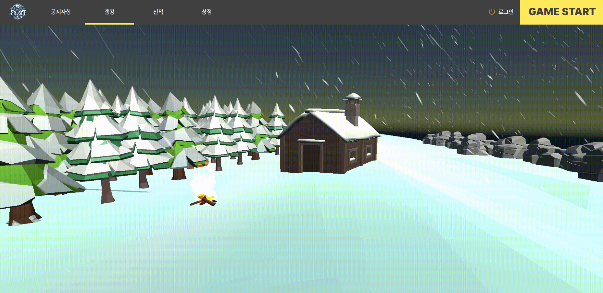

# ❄ Lost In Frost ❄

## 🎮 서비스 소개
- 평범한 생존게임은 가라! 다양한 상호작용과 랜덤 카드 선택을 통한 효과를 챙겨 30분을 버텨라! 

## 팀원 소개
- 김범창 (FE)
- 진병욱 (BE, CI/CD)

## 📆 개발 기간
- 2023.10.09 ~ 11.17 (6주)

## 💻 사용 서버
- AWS Lightsail ($80)

## 💽 개발 환경
### Frontend

- React
- Typescript
- Webpack
- Zustand
- Styled-Components

### Launcher

- Winform
- C#

### Backend
- Spring Boot
- Spring Cloud

### CI/CD
- Xshell
- nano

### API 문서
- Swagger

## 📜 사용 기술 및 라이브러리
### Frontend
- WebPack, Axios, Justand

### Backend
- JAVA
- SpringBoot, SprinSecurity, JWT
- OAuth2 (GOOGLE, NAVER, KAKAO), TossAPI
- Spring Cloud, RabbitMQ, Prometheus, Grafana
- Mysql, Redis

### CI/CD
- Nginx
- Docker
- Jenkins

## 🔎 기능 소개
### 회원가입

### 로그인

### 소셜 로그인

### 런처

### 공지사항

- 공지사항 작성

### 랭킹

### 전적

### 상점
### 마이페이지
